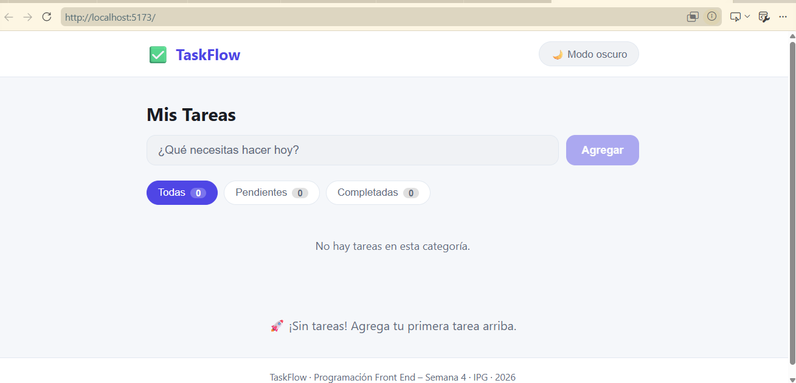
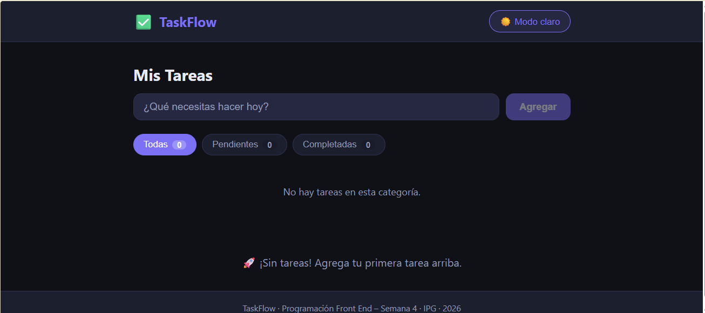

# TaskFlow — Gestor de Tareas Interactivo

Aplicación web de gestión de tareas (To-Do List) desarrollada con **React 18 + Vite 5**,
como entrega evaluativa de la Semana 4 de la asignatura *Programación Front End*,
Unidad 2: Desarrollo Avanzado de Interfaz de Usuario.
Instituto Profesional IPG — Ingeniería Informática, 2026.

---

## Descripción

TaskFlow es una Single Page Application (SPA) que implementa los fundamentos
de React: arquitectura basada en componentes funcionales, gestión de estado
local mediante el hook `useState`, efectos secundarios con `useEffect`,
y comunicación entre componentes a través de props y callbacks.

La aplicación permite al usuario gestionar su lista de tareas de forma
dinámica e interactiva, sin recarga de página, aplicando los principios
de diseño de interfaces modernas estudiados en la unidad.

---

## Funcionalidades

- **Agregar tareas** mediante formulario controlado con validación de entrada
- **Marcar como completada / pendiente** con toggle visual instantáneo
- **Eliminar tareas** individualmente
- **Filtrar** por estado: Todas · Pendientes · Completadas
- **Limpiar** todas las tareas completadas en un clic
- **Cambio de tema** claro/oscuro mediante variables CSS y `useEffect`
- **Diseño responsivo** adaptado a dispositivos móviles y escritorio
- **Accesibilidad** mediante atributos ARIA (`aria-label`, `aria-pressed`)

---

## Tecnologías utilizadas

| Tecnología | Versión | Rol |
|---|---|---|
| React | 18.3.x | Biblioteca de UI, componentes funcionales, hooks |
| Vite | 5.x | Bundler y servidor de desarrollo con HMR |
| JavaScript ES2023 | — | Lógica de la aplicación |
| HTML5 | — | Marcado semántico estructural |
| CSS3 | — | Variables custom properties, flexbox, diseño responsivo |

---

## Arquitectura de componentes
App.jsx (raíz — gestiona theme, tasks, filter)
├── Header.jsx Barra de navegación + toggle de tema
├── main
│ ├── TaskForm.jsx Formulario controlado (useState local)
│ ├── nav filtros Botones Todas / Pendientes / Completadas
│ ├── TaskList.jsx Lista de tareas filtradas
│ │ └── TaskItem.jsx × N Tarjeta individual (check, badge, delete)
│ └── btn limpiar completadas (renderizado condicional)
└── Footer.jsx Pie de página institucional

text

### Estado global gestionado en App.jsx

| Estado | Tipo | Descripción |
|---|---|---|
| `theme` | `'light' \| 'dark'` | Tema visual activo; modifica clase CSS en `<body>` |
| `tasks` | `Task[]` | Array `{ id, text, done, createdAt }` |
| `filter` | `'all' \| 'pending' \| 'done'` | Filtro activo para la vista |

---

## Flujo de datos

1. El usuario escribe en `TaskForm` → estado local `value` (useState)
2. Al hacer submit → `App.addTask(text)` agrega al array `tasks`
3. `TaskList` renderiza solo las tareas que pasan el filtro activo
4. `TaskItem` emite `onToggle` / `onRemove` → App actualiza estado → React re-renderiza
5. `Header` emite `onToggleTheme` → cambia clase en `document.body` → variables CSS responden

---

## Instalación y ejecución

### Requisitos previos

- Node.js ≥ 18.x
- npm ≥ 9.x

### Pasos

```bash
# 1. Clonar el repositorio
git clone https://github.com/<usuario>/taskflowApp.git
cd taskflowApp

# 2. Instalar dependencias
npm install

# 3. Servidor de desarrollo
npm run dev
# Abre http://localhost:5173
```

### Comandos disponibles

| Comando | Descripción |
|---|---|
| `npm run dev` | Servidor de desarrollo con HMR |
| `npm run build` | Bundle de producción en `/dist` |
| `npm run preview` | Previsualización del build |

---

## Decisiones de diseño

- **CSS Custom Properties** para sistema de temas: eliminan la necesidad de
  JavaScript adicional para cambiar estilos entre modo claro y oscuro.
- **HTML semántico**: uso de `<header>`, `<main>`, `<footer>`, `<ul>/<li>`,
  `<form>`, `<time>` y atributos ARIA para accesibilidad.
- **Responsabilidad única por componente**: cada componente encapsula una
  responsabilidad específica, facilitando mantenibilidad y escalabilidad.
- **Lifting state up**: el estado global reside en `App` y se distribuye
  hacia abajo mediante props, siguiendo el patrón unidireccional de React.
- **Paleta personalizada**: índigo `#4f46e5` en modo claro, violeta `#7c70f5`
  en modo oscuro, con tokens de color semánticos para badges de estado.

---

## Capturas de pantalla

### Modo claro


### Modo oscuro


### Tarea Activa
. *Construcción y diseo de páginas web con HTML, CSS y JavaScript*. RA-MA Editorial. https://elibro.net/es/lc/ipg/titulos/235052
- Fernández Casado, P. E. (2023). *Creación de componentes en JavaScript: curso práctico*. RA-MA Editorial. https://elibro.net/es/lc/ipg/titulos/235061
- React. (s.f.). *Quick start*. React.dev. https://react.dev/learn
- Instituto Profesional IPG. (2026). *Apunte Semana 4: Programación Front End — Gestión del estado y APIs RESTful*. IPG Virtual.
- Instituto Profesional IPG. (2026). *Apunte Semana 3: Programación Front End — Frameworks modernos de Frontend*. IPG Virtual.

---

## Autor

**Alex Labbe Rodriguez**
Carrera: Ingeniería Informática
Asignatura: Programación Front End — Semana 4
Instituto Profesional IPG · 2026